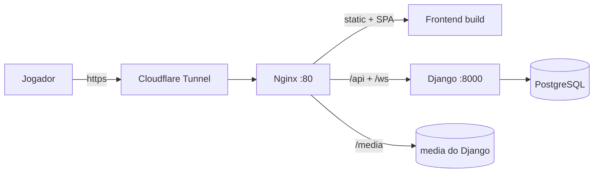

# Deploy (produção)

A ideia do deploy:

- **Frontend:** Nginx expondo o build estático na porta 80.
- **Backend + banco:** Docker (mesma máquina do Nginx).
- **Internet:** Cloudflare Tunnel (`cloudflared`) expondo `http://localhost:80`.

## 1. Instalar Nginx e Cloudflare Tunnel

```bash
sudo apt-get update
sudo apt-get install nginx -y
```

Remover o site padrão do Nginx:

```bash
sudo rm /var/www/html/index.nginx-debian.html
sudo rm /etc/nginx/sites-enabled/default
sudo rm /etc/nginx/sites-available/default
sudo nginx -t   # confere a sintaxe
```

## 2. Copiar a configuração do Nginx

Os arquivos em `deploy/nginx/` são **templates**: os tokens `@VARIAVEL@` precisam
ser substituídos pelos caminhos da sua máquina antes de irem para o lugar final.
Nada é hardcoded — veja a tabela em
[Caminhos e valores (Nginx)](#caminhos-e-valores-nginx).

```bash
cd deploy/nginx

# 2.1 Configuração principal (sem caminhos customizados)
sudo cp nginx.conf /etc/nginx/nginx.conf

# 2.2 Cria o diretório que vai receber o build do frontend (o @WEB_ROOT@)
sudo mkdir -p /var/www/dacomp_guessr
sudo chmod 755 /var/www/dacomp_guessr

# 2.3 Substitui as variáveis do template e instala o site
sudo mkdir -p /etc/nginx/conf.d
sudo sed -e "s|@WEB_ROOT@|/var/www/dacomp_guessr|" \
         -e "s|@BACKEND_HOST@|127.0.0.1|" \
         -e "s|@BACKEND_PORT@|8000|" \
         -e "s|@MEDIA_ROOT@|/home/seuuser/DACOMP_Geoguessr/backend/DACOMP_Guessr/media|" \
     simple_website.conf > /tmp/simple_website.conf
sudo cp /tmp/simple_website.conf /etc/nginx/conf.d/simple_website.conf

# 2.4 Testa a sintaxe e recarrega
sudo nginx -t
sudo nginx -s reload
```

> Se preferir não usar `sed`, edite o `simple_website.conf` manualmente trocando os
> `@VARIAVEIS@` e copie direto para `/etc/nginx/conf.d/`.

## Caminhos e valores (Nginx)

Não existe caminho fixo: tudo é definido na instalação pelos tokens abaixo.

| Token            | O que é                                             | Onde é usado                  | Valor usado no projeto / exemplo        |
| ---------------- | --------------------------------------------------- | ----------------------------- | --------------------------------------- |
| `@WEB_ROOT@`     | Raiz que recebe o build do frontend (conteúdo do `dist/`) | `root` do `location /` | `/var/www/dacomp_guessr`          |
| `@BACKEND_HOST@` | Host interno do backend Django                      | `proxy_pass` (`/api/`, `/ws/`) | `127.0.0.1`                            |
| `@BACKEND_PORT@` | Porta do backend Django                             | `proxy_pass` (`/api/`, `/ws/`) | `8000`                                 |
| `@MEDIA_ROOT@`   | Caminho absoluto até a pasta `media/` do Django (SEM barra final) | `alias` do `location /media/` | `/home/seuuser/DACOMP_Geoguessr/backend/DACOMP_Guessr/media` |

Regras práticas:

- **`@WEB_ROOT@`** — caminho absoluto de um diretório existente que o usuário do
  nginx (geralmente `http`/`nginx`) consiga **ler**. O build é copiado pra lá
  (seção 3). Se você mudar esse valor aqui, use o mesmo na seção 3.
- **`@BACKEND_HOST@` / `@BACKEND_PORT@`** — apontam para o backend Django. No padrão
  do projeto o backend roda via Docker na mesma máquina, então `127.0.0.1:8000`
  funciona (a porta é a exposta pelo `docker-compose.yaml`). Em outro host, use o
  IP/porta correspondentes. **Sem barra final** no `proxy_pass` para o caminho
  original (`/api/...`, `/ws/...`) ser mantido.
- **`@MEDIA_ROOT@`** — pasta `media/` do Django no servidor, onde ficam as imagens
  baixadas das rodadas (`media/round_images/{session_code}/`). É a mesma pasta do
  repositório `backend/DACOMP_Guessr/media` **no disco** (não dentro do container).
  O template adiciona a barra final no `alias`.

Caminhos **fixos** (são padrão do Nginx, não do projeto):

| Caminho                          | Função                                           |
| -------------------------------- | ------------------------------------------------ |
| `/etc/nginx/nginx.conf`          | Configuração principal                           |
| `/etc/nginx/conf.d/*.conf`       | Sites/vhosts (incluídos pelo `nginx.conf`)       |
| `/etc/nginx/mime.types`          | Tipos MIME (path relativo ao prefixo, `/etc/nginx`) |

> Só `/api/`, `/ws/` e `/media/` são servidos/proxied. O Django admin (`/admin/`) e
> os endpoints de CSRF **não** são expostos pelo túnel — acesse-os direto pelo
> backend em `http://localhost:8000/admin`.

## 3. Build e publicar o frontend

```bash
cd frontend/Guessing_game_frontend
npm install
npm run build
sudo cp -rf dist/* /var/www/dacomp_guessr/   # o diretório do @WEB_ROOT@
sudo nginx -s reload
```

> O `dist/` vai para o mesmo diretório definido como `@WEB_ROOT@` no template
> (seção 2). Se você usou outro caminho, copie para ele.

## 4. Expor na internet (Cloudflare Tunnel)

```bash
cloudflared tunnel --url http://localhost:80
```

O comando retorna um link `*.trycloudflare.com` acessível por outras pessoas.

**Importante:** a cada execução o link muda. Sempre que rodar o túnel, adicione esse
host no backend (`backend/DACOMP_Guessr/DACOMP_Guessr/settings.py`):

- `ALLOWED_HOSTS`
- `CORS_ALLOWED_ORIGINS`
- `CSRF_TRUSTED_ORIGINS`

Esses três arrays já têm um domínio antigo de exemplo no lugar; substitua pelo novo.

## 5. Subir backend e banco

Na raiz do repositório (mesma máquina do Nginx):

```bash
cp .env.example .env   # se ainda não tiver
docker compose up --build
```

## Fluxo completo



## Checklist de testes após o deploy

1. Abrir o link do túnel e entrar numa sala.
2. WebSocket conectado na aba de rede (evento de `join_success`).
3. Enviar um palpite e ver `guess_received` com a pontuação.
4. Fim da partida mostrando o ranking (`session_status_update` FINISHED).