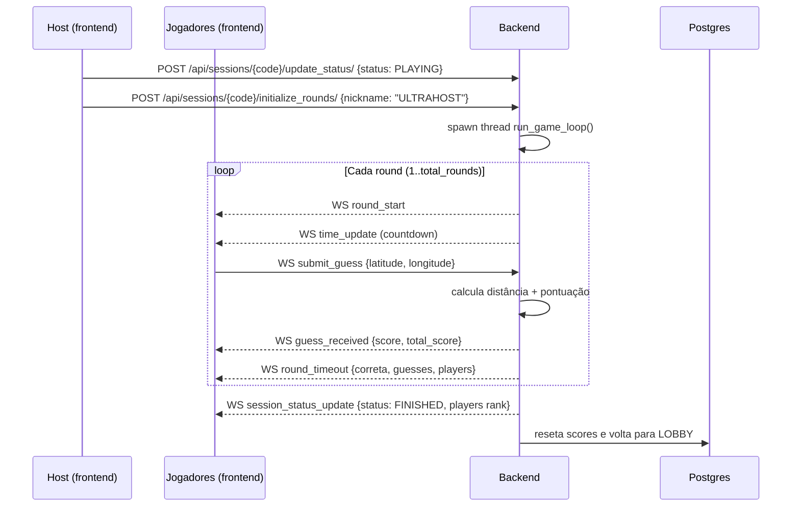

# Arquitetura

## Visão geral

Aplicação estilo [GeoGuessr](https://www.geoguessr.com): o jogador vê uma foto de um
lugar dentro da UFSCar São Carlos e precisa marcar no mapa onde acha que a foto foi
tirada. Quanto mais perto e mais rápido, mais pontos.

O sistema é dividido em três partes:

| Componente   | Tecnologia                                  | Porta (dev)  |
| ------------ | ------------------------------------------- | ------------ |
| Frontend     | React + TypeScript + Vite + Tailwind + Leaflet | `5173`     |
| Backend      | Python + Django + Django REST Framework + Django Channels (WebSocket) | `8000` |
| Banco de dados | PostgreSQL 15                              | `5432`     |

## Componentes

```
+---------------------+      REST (HTTP)      +---------------------+
|                     |   /api/..., /proxy/   |                     |
|   Frontend React    | <-------------------> |   Django REST API   |
|   (Vite :5173)      |                       |   (Daphne :8000)    |
|                     |                       |                     |
|                     |   WebSocket           |   Django Channels   |
|                     | <-------------------> |   (WS consumer)     |
+---------------------+   /ws/lobby/{code}/   +----------+----------+
                                                          |
                                                          | ORM
                                                   +------v------+
                                                   |  PostgreSQL  |
                                                   |    :5432     |
                                                   +-------------+
```

## Como as partes se comunicam

### REST (requisição/resposta)

Usado para tudo que é pontual:

- Criar/listar/editar sessões, jogadores, localizações e rodadas (`/api/*`).
- Host iniciar o jogo (`update_status` + `initialize_rounds`).
- Buscar a imagem da rodada atual (`/api/rounds/current-image/`).
- Proxy de download das imagens do Google Drive (`/proxy/`).

### WebSocket (tempo real)

Usado para o que precisa ser broadcast para todos na sala:

- Entrar/reconectar na sala (`join`, `reconnect`).
- Atualização da lista de jogadores e avatares.
- Loop do jogo: início de rodada, countdown, fim de rodada e resultado final.
- Envio de palpites (`submit_guess`) e resposta com a pontuação.

Todo cliente conectado em uma mesma sessão entra no grupo `session_{code}` do
channel layer. As mensagens do jogo são enviadas para esse grupo.

## Ciclo de vida da sessão

```
INACTIVE  ->  LOBBY  ->  PLAYING  ->  FINISHED  ->  (volta a LOBBY)
```

- `INACTIVE` — criada, ainda não usada.
- `LOBBY` — jogadores entram na sala (status padrão). Entrada só é aceita aqui.
- `PLAYING` — jogo em andamento.
- `FINISHED` — jogo acabou; o frontend exibe o ranking final.
- Ao final do loop do jogo, o backend reseta a sessão de volta para `LOBBY`
  (mantendo o código, para uma nova partida).

## Fluxo de uma partida



Detalhe importante: o host inicia o jogo por **REST** (`initialize_rounds`), que
dispara uma thread com o `run_game_loop` (em `Guessing_Game/gamelogic.py`). Depois
disso, tudo é conduzido pelo WebSocket.

## Pontuação

Definida em `Guessing_Game/consumers.py` (`calculate_score`):

1. **Distância** (Haversine, em metros):
   `dist_score = 1000 * exp(-distancia / 600)` (máx. 1000)
2. **Bônus de tempo**:
   `time_bonus = tempo_restante / tempo_limite`
3. **Pontuação final**:
   `final = dist_score * (0.75 + 0.25 * time_bonus)` (limitado a 0–1000)

Ou seja: acerto perfeito vale até 1000 pontos, e cada segundo economizado no
palpite adiciona até 250 pontos ao "peso" da distância.

## Imagens das localizações

As fotos ficam no Google Drive. Cada `Location` guarda a `image_url` do Drive. Duas
formas de acesso:

- `Location.image_url` direta (usada durante o lobby/seed).
- `GET /api/rounds/current-image/` — o backend baixa a imagem uma vez, salva em
  `media/round_images/{session_code}/` e serve pela `MEDIA_URL`. Em produção o
  frontend usa essa rota para não expor o Drive.

## Estrutura de pastas (backend)

```
backend/DACOMP_Guessr/
├── DACOMP_Guessr/            # projeto Django (settings, urls, asgi)
├── Guessing_Game/            # app principal
│   ├── models.py             # Session, Location, Round, Player, Guess
│   ├── serializers.py        # DRF serializers
│   ├── views.py              # ViewSets + proxy + CSRF + start_game
│   ├── consumers.py          # WebSocket (entrada, palpites, pontuação)
│   ├── gamelogic.py           # loop do jogo (paralelo, via thread)
│   ├── routing.py            # rotas do WebSocket
│   └── management/
│       ├── commands/
│       │   ├── seeder.py             # seed de locations/sessions/rounds
│       │   └── create_default_admin.py
│       └── seeders/                  # CSVs + scripts de seed
├── Dockerfile
├── entrypoint.sh             # migrações + admin + seed + runserver
└── requirements.txt
```